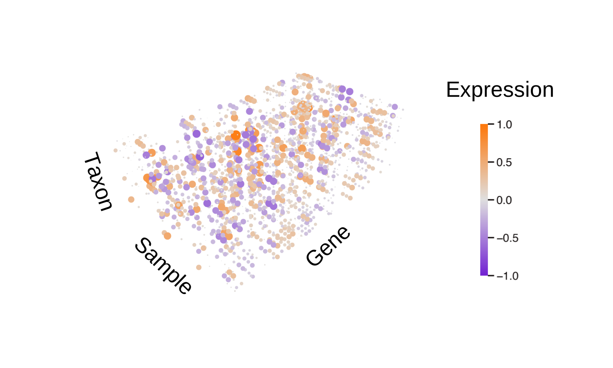
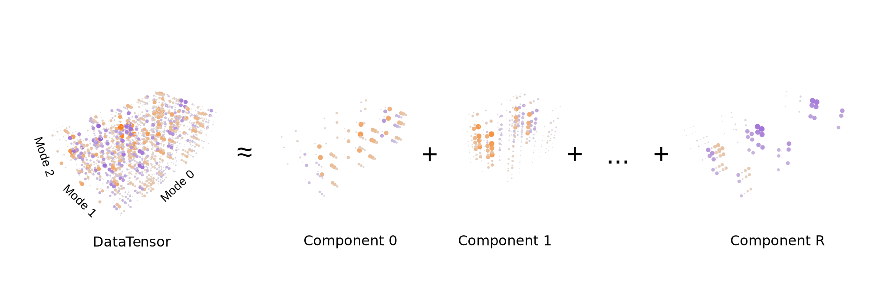

Sparse tensor decomposition
===========================

Barnacle was developed to implement a sparse tensor decomposition 
model. Let's unpack that.

What is a tensor?
-----------------

Tensors are multidimensional arrays. Put another way, a tensor is a
generalization of an array, in that a zero-order tensor is a scalar, a 
first-order tensor a vector, a second-order tensor a matrix, and tensors 
of third-order and above are higher dimensional arrays. 

Practically, tensors are a good way of organizing datasets that may be 
characterized by multilinear relationships. For example, the expression level 
of a particular gene is likely affected by at least three variables: the 
identity of the gene, the taxonomy of the organism carrying the gene, and the 
environmental context of the sampling conditions. In this case, the 
interactions of those three variables can be represented by arranging 
the gene expression data in a third-order tensor, with each variable assigned 
to a different axis, called a "mode". 

   Example of a third-order tensor of gene expression data.

For a more comprehensive overview of tensor concepts and terminology, check 
out the classic review by 
`Kolda and Bader (2009) <https://doi.org/10.1137/07070111X>`_ :cite:p:`kolda2009tensor`. 
The `TensorLy <https://tensorly.org>`_ :cite:p:`kossaifi2019tensorly` and 
`TLViz <http://tensorly.org/viz/stable/>`_ :cite:p:`roald2022tlviz` 
documentation sites are also good resources for information and examples on 
tensors and their analysis. 

What is tensor decomposition?
-----------------------------

Tensor decomposition is a way of disentangling the different patterns 
or signals that make up a tensor dataset. While there are different types of 
tensor decomposition models, classical CP tensor decomposition 
models the data as a sum of constituent components, each of which 
represents a distinct multilinear pattern. A nice example comes from signal 
processing: if you have a recording of several people in a room all speaking 
simultaneously, you might use tensor decomposition to identify and separate 
out each person's voice into its own distinct channel. In this case the 
original jumbled recording data would be arranged into the input data tensor, 
and the output would be a unique component for each speaker's voice.

   Diagram of a tensor decomposition model.

For a more in-depth primer on tensor decomposition techniques and applications, 
we again recommend the 
`review article by Kolda and Bader (2009) <https://doi.org/10.1137/07070111X>`_ 
:cite:p:`kolda2009tensor`.

What about the "sparse" part?
-----------------------------

In statistics, sparsity refers to a data array that primarily consists of 
zeros. Sparsity can be a challenge in some contexts, or a desireable property 
in other cases. In our case, we prefer sparse components, because it helps 
focus our analysis on the most significant patterns and drivers in large, 
complex datasets. 

For this reason, when we fit the tensor decomposition model, we require the 
components to be sparse in one or more modes. This is accomplished by applying 
an l1 sparsity constraint, similar to classical lasso regression 
:cite:p:`tibshirani1996regression`. The result is simpler, more interpretable 
components that can reveal previously hidden patterns in complex data.

Got it. What's it good for?
---------------------------

Barnacle is primarily intended as a tool for unsupervised signal discovery. 
In other words, it can help you figure out the major patterns driving the 
variation in a large multi-way dataset. The sparsity constraint also enables 
clusters to be derived from components by identifying in each component 
the elements associated with non-zero weights.

Barnacle was developed with metatranscriptomic datasets in mind. However, it 
could feasibly be applied to any multi-way dataset, and would be especially
well suited for other omics datasets. For more on this please see the 
:doc:`omics<omics>` section.

Tensor decomposition models have additionally been used to analyze everything
from MRI data :cite:p:`yu2014multidimensional` to fish ecology 
:cite:p:`frelat2017community`. How could tensor decomposition help you 
better understand your data?

Can you provide a little more detail?
-------------------------------------

Yes. Our sparse tensor decomposition model aims to minimize loss functions
of the following form:

.. math::
    
    \|Y - \hat{Y}\|^2 + \lambda_0\|F_0\|_1 + ... + \lambda_{i}\|F_{i}\|_1
    
where :math:`Y` is the input data tensor, :math:`\hat{Y}` is the model 
reconstruction of the input tensor, and the additional terms encompass the 
l1 sparsity penalties applied to the factor weights :math:`F_i` applied to each
of :math:`i` modes, modulated by the corresponding sparsity coefficient 
:math:`\lambda_i`. Setting :math:`\lambda` to zero in any mode removes the 
sparsity constraint from that mode. Additionally, non-negativity constraints 
can be applied to any mode in conjunction with or in place of sparsity 
constraints.

The model must be parameterized with two user-supplied values: 
- :math:`R`: dictates "rank", or the number of components in the model
- :math:`\lambda`: the sparsity coefficient that modulates the level of sparsity in each mode.

Selecting the best parameterization can be non-trivial for tensor decomposition 
problems. One approach is to use cross-validation, which we outline in 
:doc:`one of the notebooks<notebooks/cross-validation>` in the 
:doc:`example gallery<examples>`. 

Once parameterized, the model is fit to data using a modified alternating 
least squares algorithm. We accommodate the constraints placed on 
each mode by means of the Fast Iterative Shrinkage/Thresholding Algorithm 
(FISTA) :cite:p:`beck2009fast` with backtracking and adaptive restart 
:cite:p:`o2015adaptive`. You can find our implementation of this in the 
:doc:`barnacle.fista<autodoc/barnacle/barnacle.fista>` module. 

For a more in-depth technical discussion of the model, 
please see our publication.
